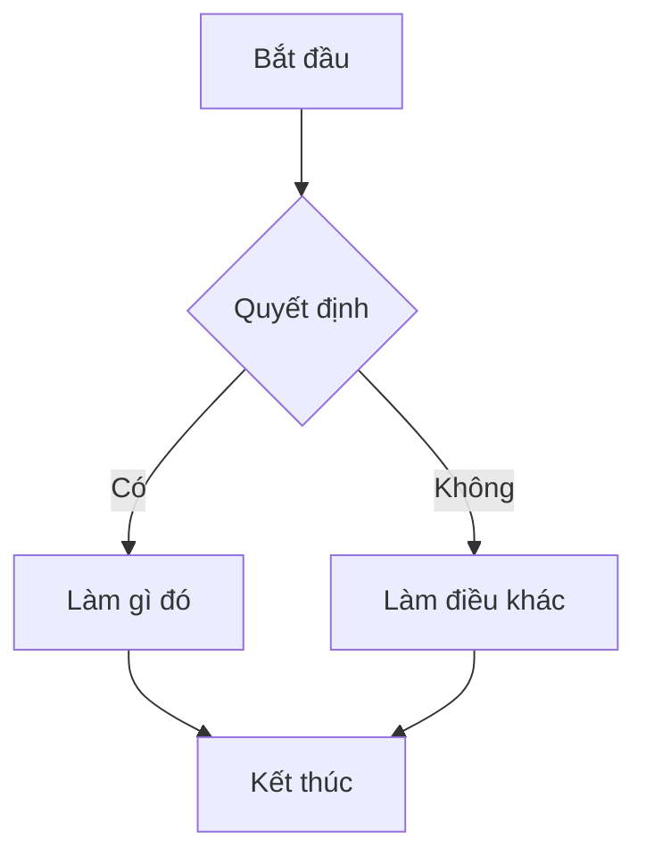

Đây là bản demo về cách mọi thứ trông như thế nào.

Bảng hướng dẫn markdown sau đây được điều chỉnh từ: [https://guides.github.com/features/mastering-markdown/](https://guides.github.com/features/mastering-markdown/)

# Markdown là gì?

Markdown là một cách để định dạng văn bản trên web. Bạn kiểm soát cách hiển thị của tài liệu; định dạng từ ngữ thành đậm hoặc nghiêng, thêm hình ảnh, và tạo danh sách chỉ là một vài trong số những điều chúng ta có thể làm với Markdown. Phần lớn, Markdown chỉ là văn bản thông thường với một vài ký tự không phải chữ cái được thêm vào, như `#` hoặc `*`.

# Hướng dẫn cú pháp

Đây là tổng quan về cú pháp Markdown mà bạn có thể sử dụng ở bất kỳ đâu trên GitHub.com hoặc trong các tệp văn bản của riêng bạn.

## Tiêu đề

```markdown
# Đây là thẻ h1

## Đây là thẻ h2

#### Đây là thẻ h4
```

# Đây là thẻ h1

## Đây là thẻ h2

#### Đây là thẻ h4

## Nhấn mạnh

```markdown
_Văn bản này sẽ được in nghiêng_

**Văn bản này sẽ được in đậm**

_Bạn **có thể** kết hợp chúng_
```

*Văn bản này sẽ được in nghiêng*

**Văn bản này sẽ được in đậm**

*Bạn **có thể** kết hợp chúng*

## Danh sách

### Không có thứ tự

```markdown
- Mục 1
- Mục 2
  - Mục 2a
  - Mục 2b
```

* Mục 1
* Mục 2
  * Mục 2a
  * Mục 2b

### Có thứ tự

```markdown
1. Mục 1
1. Mục 2
1. Mục 3
   1. Mục 3a
   1. Mục 3b
```

1. Mục 1
2. Mục 2
3. Mục 3
   1. Mục 3a
   2. Mục 3b

## Hình ảnh

```markdown

Định dạng: 
```


## Liên kết

```markdown
http://tina.io - tự động!
[TinaCMS](http://tina.io)
```

[http://tina.io](http://tina.io) - tự động!
[TinaCMS](http://tina.io)

## Trích dẫn

```markdown
Như Napoleon đã nói về con liger:

> Đó là loài động vật yêu thích của tôi.
> Nó giống như sự kết hợp giữa sư tử và hổ... được lai tạo cho kỹ năng ma thuật của nó.
```

Như Napoleon đã nói về con liger:

> Đó là loài động vật yêu thích của tôi.
> Nó giống như sự kết hợp giữa sư tử và hổ... được lai tạo cho kỹ năng ma thuật của nó.

## Mã nội dòng

```markdown
Tôi nghĩ bạn nên sử dụng phần tử
`<addr>` ở đây thay thế.
```

Tôi nghĩ bạn nên sử dụng phần tử
`<addr>` ở đây thay thế.

## Tô sáng cú pháp

Đây là ví dụ về cách bạn có thể sử dụng tô sáng cú pháp với [GitHub Flavored Markdown](https://help.github.com/articles/basic-writing-and-formatting-syntax/):

````markdown
```js:fancyAlert.js
function fancyAlert(arg) {
  if (arg) {
    $.facebox({ div: '#foo' })
  }
}
```
````

Và đây là cách nó trông - được tô màu đẹp mắt với tiêu đề mã được định dạng!

```js:fancyAlert.js
function fancyAlert(arg) {
  if (arg) {
    $.facebox({ div: '#foo' })
  }
}
```

## Bảng

Bạn có thể tạo bảng bằng cách tập hợp danh sách các từ và phân chia chúng bằng dấu gạch ngang `-` (cho hàng đầu tiên), và sau đó phân tách mỗi cột bằng dấu gạch dọc `|`:

```markdown
| Tiêu đề đầu tiên                | Tiêu đề thứ hai                |
| --------------------------- | ---------------------------- |
| Nội dung từ ô 1         | Nội dung từ ô 2          |
| Nội dung trong cột đầu tiên | Nội dung trong cột thứ hai |
```

| Tiêu đề đầu tiên                | Tiêu đề thứ hai                |
| --------------------------- | ---------------------------- |
| Nội dung từ ô 1         | Nội dung từ ô 2          |
| Nội dung trong cột đầu tiên | Nội dung trong cột thứ hai |

## Biểu đồ

Bạn có thể sử dụng biểu đồ Mermaid để trực quan hóa luồng, chuỗi và các loại biểu đồ khác trực tiếp trong Markdown. Đây là ví dụ về biểu đồ luồng Mermaid:



Khi được hiển thị, điều này sẽ tạo ra một biểu đồ luồng trong đó các quyết định dẫn đến các đường dẫn khác nhau. Mermaid cũng hỗ trợ biểu đồ chuỗi, biểu đồ Gantt, biểu đồ lớp và nhiều loại khác. Để biết đầy đủ các khả năng, hãy xem tài liệu Mermaid: [https://mermaid-js.github.io/mermaid/](https://mermaid-js.github.io/mermaid/)
