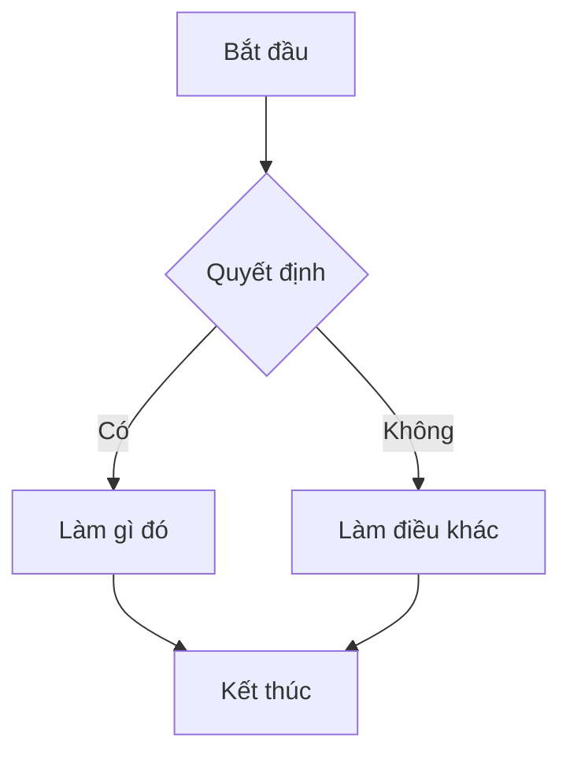
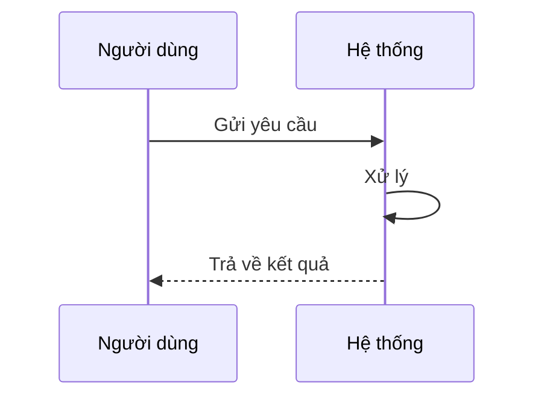
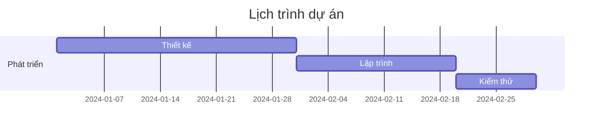
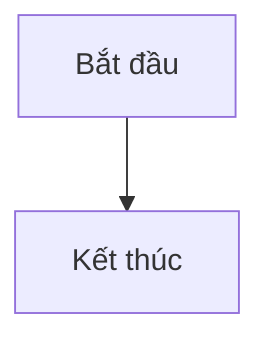

Mermaid là một công cụ tạo biểu đồ dựa trên văn bản, cho phép bạn tạo biểu đồ và sơ đồ bằng cách sử dụng cú pháp tương tự như Markdown. Điều này làm cho việc tạo và duy trì biểu đồ trở nên dễ dàng hơn nhiều so với các công cụ trực quan truyền thống.

## Các loại biểu đồ

Mermaid hỗ trợ nhiều loại biểu đồ khác nhau:

### Biểu đồ luồng (Flowchart)



### Biểu đồ chuỗi (Sequence Diagram)



### Biểu đồ Gantt



## Cách sử dụng

Để sử dụng Mermaid trong Markdown của bạn, chỉ cần bọc mã biểu đồ của bạn trong khối mã với nhãn `mermaid`:

````markdown

````

## Lợi ích

* **Dễ dàng tạo và duy trì** - Biểu đồ được tạo từ văn bản, dễ dàng chỉnh sửa và quản lý phiên bản
* **Tích hợp với Markdown** - Hoạt động hoàn hảo trong các tài liệu Markdown
* **Nhiều loại biểu đồ** - Hỗ trợ nhiều loại biểu đồ khác nhau
* **Tùy chỉnh** - Có thể tùy chỉnh màu sắc, kiểu dáng và bố cục

## Tài liệu tham khảo

Để tìm hiểu thêm về Mermaid và các tính năng của nó, hãy truy cập [tài liệu chính thức](https://mermaid-js.github.io/mermaid/).
